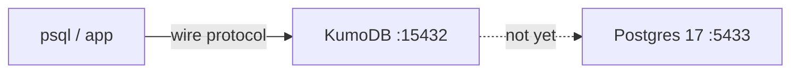

# KumoDB

A PostgreSQL-compatible proxy in Go, inspired by PlanetScale [Neki](https://planetscale.com/blog/what-is-a-neki-router). It is a **protocol-aware frontend**, not a TCP forwarder and not PgBouncer-plus-hashing.

**Now (session 2 / milestone 2.6):** KumoDB speaks enough of the [frontend/backend protocol](https://www.postgresql.org/docs/current/protocol.html) that `psql` can log in (trust, no password), send simple queries, and stay connected. Queries are **refused** with `feature_not_supported`. The process does **not** dial Postgres yet.

Requires Go 1.26+ and Docker Compose.

Session write-up: [KumoDB session 1](https://avikmukherjee.com/blog/kumodb-session-1-postgres-wire-protocol)

## Architecture

What exists today:

```text
  psql / driver
        │  PostgreSQL wire (TCP)
        ▼
  127.0.0.1:15432
        │
        ▼
     KumoDB
        │  SSLRequest → 'N' (no TLS)
        │  StartupMessage → user / database
        │  AuthenticationOk + ReadyForQuery
        │  Query → ErrorResponse + ReadyForQuery
        │  Terminate → close
        │
        ✕  does not dial Postgres yet

  127.0.0.1:5433 ──► Docker postgres:17 (:5432)
                    user/password/database: postgres
                    (Compose only; unused by the Go binary)
```



Target later (not built): `psql → KumoDB → PostgreSQL`, then pooling, then sharding. Do not treat that as the current binary.

## Protocol path (one connection)

1. Optional **SSLRequest** (`80877103`). Reply is one byte `'N'`, then the real startup on the **same** TCP connection.
2. **StartupMessage** — no type byte; length + protocol `3.0` (`196608`) + `key\\0value\\0…\\0`.
3. **AuthenticationOk** (`'R'`, code `0`) then **ReadyForQuery** (`'Z'`, idle `'I'`). No `ParameterStatus` / `BackendKeyData` yet.
4. **Simple Query** (`'Q'`). Reply is **ErrorResponse** (`'E'`, SQLSTATE `0A000`) then `'Z'` again so the session continues.
5. **Terminate** (`'X'`) or client/process shutdown closes the socket.

Regular messages (after startup) are `type + int32 length + payload`. Length includes itself, not the type byte. Startup is the exception: no type byte, remaining size is `length - 8`.

## Run

```bash
go test -race ./...
docker compose up -d --wait
go run ./cmd/kumodb                 # 127.0.0.1:15432; Ctrl+C to stop
```

Talk to KumoDB (expect an error on SQL, not a dropped connection):

```bash
psql "host=127.0.0.1 port=15432 user=postgres dbname=postgres sslmode=disable"
```

No host `psql`? Use the Compose client (Docker Desktop / OrbStack: `host.docker.internal`):

```bash
docker compose exec postgres psql \
  "host=host.docker.internal port=15432 user=postgres dbname=postgres sslmode=disable" \
  -c 'SELECT 1'
```

Talk to **Postgres directly** (bypasses KumoDB):

```bash
docker compose exec postgres psql -U postgres -d postgres -c 'SELECT 1'
```

Host map is **`5433:5432`**. Port 5432 on the host is left for other stacks. Data lives in the `postgres_data` volume.

```bash
docker compose down
```

## Layout

```text
cmd/kumodb/     process: listen, protocol, tests
docker-compose.yml
```

No `internal/` packages yet. One binary. Stdlib only.
